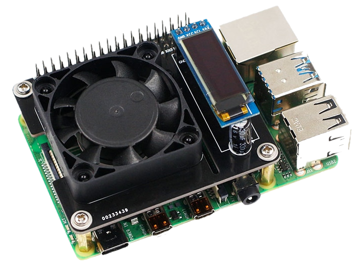

# Raspberry PI 3/4 temperature control

Sources for intelligent Control Fan Speed Temperature Control LCD Ice Fan Expention Board for Raspberry Pi 4/3B+/3B ([aliexpress](https://www.aliexpress.com/item/4000495316081.html))

 

## Install step by step

- Preparation
  - ```sudo apt update && sudo apt upgrage```
  - ```sudo apt install git && sudo apt install gcc```
- Install WiringPi
  - ```git clone https://github.com/WiringPi/WiringPi.git```
  - ```cd WiringPi```
  - ```sudo ./build```
  - ```gpio -v```
- Install Rpi tepmctl
  - ```git clone https://github.com/pachman/rpi-tempctl.git```
  - ```cd rpi-tempctl```
  - ```sudo sh install.sh```
  - ```sudo sh start.sh```

## Tested OS

- Raspberry Pi 3 model B, ARM x64 Ubuntu 20.04.1 LTS
